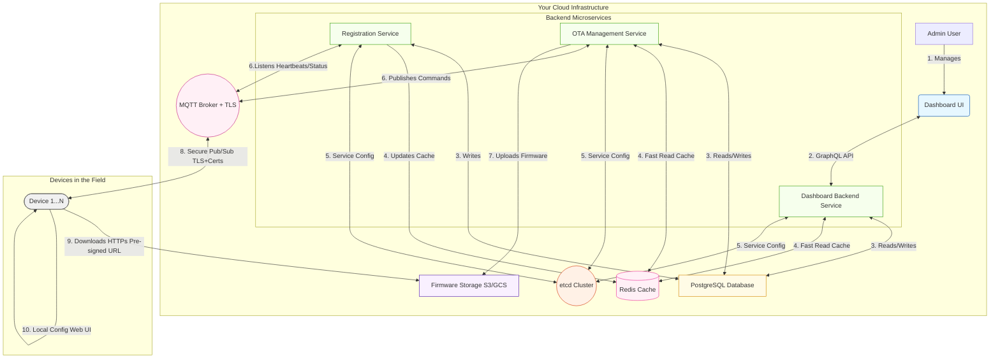
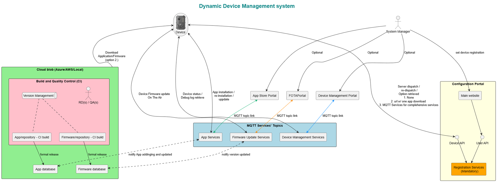

https://www.tuvrblog.com/zh-tw/11265.html
## Spec
## System Architecture Diagram (Mermaid)

This diagram shows how the microservices interact.

 

##高階摘要

兩個設計都針對物聯網裝置的 OTA / 遠端裝置管理，採用 MQTT 做即時通訊、HTTPS/雲端物件儲存做韌體/應用檔案傳遞。
- 附圖（Dynamic Device Management system）是一個偏產品流程與 CI → 發行導向的高階圖，強調 CI、App/Firmware DB、各入口（App Store / FOTA / Device Management）與 MQTT topic 流向。
- 2026_propose.md 則是一份完整的微服務級建議書，包含服務拆分、Redis 快取、etcd 做服務協調、觀測、資安、容量建議、GraphQL + gqlgen 與前端實作建議等較多的運維與技術細節。
##相似處

- 運輸與交付：兩者都以 MQTT 作命令與狀態的即時通訊，並以 HTTPS（S3/GCS/MinIO）傳送韌體二進位檔案。
- 核心功能：都包含裝置註冊/管理、韌體庫、OTA/FOTA 服務與管理後台（Dashboard / Portal）。
- CI/發行流程：CI build → artifact 存入 DB/儲存 → 通知後端/服務發送通知給裝置，這條流程兩邊都有。
- 裝置端行為：裝置透過 MQTT 接收命令、透過 HTTPS 下載並驗證韌體，然後回報狀態。

##主要差異（要點）

- 細節層級與範圍：
圖表：偏流程視覺與產品面（誰上傳、哪些 Portal、哪些 topic）。
文件：從架構、選型、運維、監控、安全到實作建議都涵蓋，屬於架構設計級的提案。
- 服務拆分與基礎設施：
圖表：用「MQTT Services' Topics」把功能簡化為幾個服務模組（App Services / Firmware Update Services / Device Management Services）。
文件：明確拆成 Registration Service、OTA Management、Dashboard Backend、使用 Redis、Postgres、etcd 等。
- 快取與讀取路徑：
圖表：未顯式標示快取層。
文件：使用 Redis 作 TTL 快取、Pub/Sub、減輕 DB 讀取壓力。
- 服務發現與配置：
圖表：未提到。
文件：建議使用 etcd 做 service config、leader election。
- API 與前端模式：
圖表：顯示各 Portal 的角色。
文件：建議 GraphQL（gqlgen）、前端用 Apollo + subscriptions，並提供 schema / resolver 範例。
- 資安細節：
圖表：未明確顯示 certificate / signing / secrets 流程。
文件：詳細建議 mTLS、X.509 裝置憑證、韌體簽章、預簽名 URL、以及 Vault 等祕密管理。
- 觀測與運維：
圖表：無監控/記錄/追蹤元件。
文件：包含 Prometheus、ELK/Loki、Jaeger/OpenTelemetry、告警門檻與 RTO/RPO 建議。
- 回滾與部署安全：
圖表：只呈現派發流程（未顯式分段/金絲雀）。
文件：有回滾（A/B partition）流程；但文件也可擴充金絲雀/漸進發布細節（我先前建議加入）。
- 資料模型與索引：
圖表：只有概念性的 App DB / Firmware DB。
文件：提供 PostgreSQL schema（devices, firmware, campaigns, campaign_devices）與其欄位建議。
- 規模與可用性建議：
圖表：未提供節點數/叢集建議。
文件：建議 MQTT 叢集規模、Redis cluster、Postgres read replicas、PgBouncer、K8s HPA 等，並給出效能目標（API latency、MQTT delivery、下載速率）。

##圖表相對於文件的缺漏（運維/可用性風險）

- 沒有快取（Redis）會使得高併發讀查全落到 DB。
- 未描述服務發現/配置中心（etcd），容易造成部署時硬編碼或不一致配置。
- 未包含觀測/告警/追蹤，發生問題時難以根因分析。
- 未顯示裝置憑證發放或註冊流程（bootstrap、JITR/JITP、憑證輪替）— 對安全至關重要。
- 未描述漸進發布/金絲雀策略、分批與自動化閘道（以避免大規模失敗）。
- 圖表的補強處（文件較少強調的實務流程）

明確呈現 CI → App/Firmware DB → Portal → MQTT topic 的實體流程，對產品與 CI 負責人更直觀。
分離 App database 與 Firmware database 的概念，對於產品管理與版本管理有幫助。
顯示多入口（App Store, FOTAPortal, Device Management）如何各自觸發或使用 MQTT topic，便於定義前端角色與 UX。

High-level summary

Both designs target OTA/remote device management using MQTT + cloud storage for firmware, plus backend services and an admin UI.
The diagram is a more compact, product-process view focused on CI → firmware/app DB → MQTT topics → device delivery and portals (App Store / FOTA / Device Management).
2026_propose.md is a full microservice architecture proposal: detailed service decomposition, caches, service coordination (etcd), security, observability, scaling targets, GraphQL API and frontend patterns, and many operational details.
Similarities

Transport and delivery:
Both use MQTT as the real-time message bus for commands/status and HTTPS/cloud blob (S3/Azure) for firmware/app binaries.
Core functional pieces:
Registration / device management, firmware repository, OTA/FOTA services, and an admin/dashboard portal appear in both.
CI / release flow:
Both show CI/build producing firmware/app artifacts and updating a DB or repository that triggers notification to backend services.
Device-side behaviour:
Diagram and doc both show devices downloading binaries over HTTPS and receiving commands via MQTT.
Key differences (practical / architectural)

Level of detail and scope
Diagram: high-level product flow + CI integration and UI portals; focuses on where artifacts live and which MQTT topics deliver which type of content.
2026_propose.md: architecture-level design with technology choices, operational concerns (HA, backup), scalability math, monitoring, security practices, and implementation hints (gqlgen, Redis, Postgres, etcd).
Service decomposition & infrastructure
Diagram: groups MQTT-handling into "MQTT Services' Topics" (App Services, Firmware Update Services, Device Management Services) — a compact single-layer service view.
Doc: explicit separate microservices (Registration, OTA Management, Dashboard Backend), Redis cache layer, PostgreSQL as source-of-truth, etcd for service coordination, and explicit SRE patterns (replicas, clusters).
Caching and fast reads
Diagram: no explicit cache (Redis) or explanation of fast-path reads.
Doc: explicit Redis usage for TTL device state, pub/sub bridging, and performance targets.
Service discovery / configuration
Diagram: no mention of service discovery or configuration store.
Doc: uses etcd for discovery, leader election, and shared configuration.
API layer & frontend model
Diagram: portals (App Store, FOTAPortal, Device Management Portal) are shown as separate external portals that link into MQTT/topics and DBs — mainly UI/process view.
Doc: recommends GraphQL backend, gqlgen, React + Apollo + subscriptions for real-time dashboards and details on resolver patterns and subscription scaling.
Security specifics
Diagram: does not show certificates, TLS, signing, or secrets management explicitly.
Doc: detailed security architecture — mTLS, X.509 per-device certs, certificate revocation, signed firmware, JWT/RBAC, secrets in Vault.
Observability & operational practices
Diagram: no logging/monitoring/tracing components shown.
Doc: includes Prometheus metrics, logging (ELK/Loki), tracing (Jaeger/OpenTelemetry), alerting thresholds, and RTO/RPO.
Rollout & safety controls
Diagram: implied manual or portal-driven dispatch; no staged rollout or canary strategy shown.
Doc: explicit flows include rollback, and I recommended staged rollouts and gating (the doc itself mentions rollback; I suggested adding more staged rollout detail).
Data model and indexing
Diagram: shows App DB and Firmware DB conceptually but no schema or indexing recommendations.
Doc: proposes full PostgreSQL schema (devices, firmware, campaigns, campaign_devices) and suggested fields.
Resilience and scale guidance
Diagram: no node counts, HA patterns, or capacity planning.
Doc: explicit scaling recommendations (MQTT cluster sizing, Redis cluster, Postgres read replicas, PgBouncer, K8s HPA) and performance targets.
Gaps in the diagram relative to the doc (i.e., things the diagram omits that matter operationally)

No cache layer — causes heavier DB load in high-scale read scenarios.
No service coordination (etcd) for config/leader election; easier to misconfigure at scale.
No observability/alerting or DR/backup flows.
No device provisioning/onboarding or certificate lifecycle shown (important for security).
No staged rollout/canary automation or success-gating workflow.
No mention of resumable downloads, chunking, or handling intermittent connectivity for firmware downloads.
