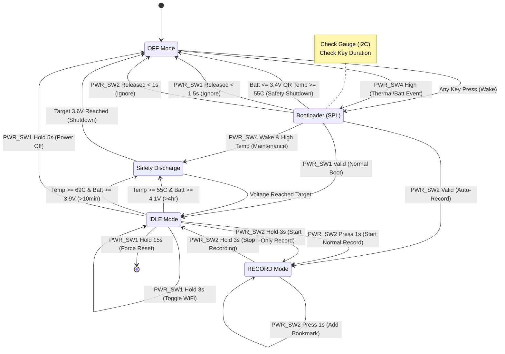

## Spec

## System Architecture Diagram (Mermaid)

This diagram shows how the microservices interact.

 

---

## 高階摘要

兩個設計都針對物聯網裝置的 OTA / 遠端裝置管理，採用 **MQTT** 做即時通訊、**HTTPS/雲端物件儲存** 做韌體/應用檔案傳遞。

-   **附圖 (Dynamic Device Management system)**：一個偏產品流程與 CI/CD 發行導向的高階圖，強調 CI、App/Firmware DB、各入口 (App Store / FOTA / Device Management) 與 MQTT Topic 的整合。

-   **`2026_propose.md` 文件**：一份完整的微服務級建議書，包含服務拆分、**Redis** 快取、**etcd** 做服務協調、觀測、資安、容量建議、**GraphQL + gqlgen** 與前端實作建議等。

## 相似處

-   **運輸與交付**：兩者都以 **MQTT** 作命令與狀態的即時通訊，並以 **HTTPS** (S3/GCS/MinIO) 傳送韌體二進位檔案。
-   **核心功能**：都包含裝置註冊/管理、韌體庫、OTA/FOTA 服務與管理後台 (Dashboard / Portal)。
-   **CI/發行流程**：CI build → artifact 存入 DB/儲存 → 通知後端/服務發送通知給裝置，這條流程兩邊都有。
-   **裝置端行為**：裝置透過 **MQTT** 接收命令、透過 **HTTPS** 下載並驗證韌體，然後回報狀態。

## 主要差異

-   **細節層級與範圍**：
    -   **圖表**：偏流程視覺與產品面 (誰上傳、哪些 Portal、哪些 topic)。
    -   **文件**：從架構、選型、運維、監控、安全到實作建議都涵蓋，屬於架構設計級的提案。

-   **服務拆分與基礎設施**：
    -   **圖表**：用「MQTT Services' Topics」把功能簡化為幾個服務模組 (App Services / Firmware Update Services / Device Management Services)。
    -   **文件**：明確拆成 Registration Service、OTA Management、Dashboard Backend，並使用 **Redis**、**Postgres**、**etcd** 等。

-   **快取與讀取路徑**：
    -   **圖表**：未顯式標示快取層。
    -   **文件**：使用 **Redis** 作 TTL 快取、Pub/Sub、減輕 DB 讀取壓力。

-   **服務發現與配置**：
    -   **圖表**：未提到。
    -   **文件**：建議使用 **etcd** 做 service config、leader election。

-   **API 與前端模式**：
    -   **圖表**：顯示各 Portal 的角色。
    -   **文件**：建議 **GraphQL (gqlgen)**、前端用 Apollo + subscriptions，並提供 schema / resolver 範例。

-   **資安細節**：
    -   **圖表**：未明確顯示 certificate / signing / secrets 流程。
    -   **文件**：詳細建議 **mTLS**、X.509 裝置憑證、韌體簽章、預簽名 URL、以及 **Vault** 等祕密管理。

-   **觀測與運維**：
    -   **圖表**：無監控/記錄/追蹤元件。
    -   **文件**：包含 **Prometheus**、**ELK/Loki**、**Jaeger/OpenTelemetry**、告警門檻與 RTO/RPO 建議。

-   **回滾與部署安全**：
    -   **圖表**：只呈現派發流程 (未顯式分段/金絲雀)。
    -   **文件**：有回滾 (A/B partition) 流程，並可擴充金絲雀/漸進發布細節。

-   **資料模型與索引**：
    -   **圖表**：只有概念性的 App DB / Firmware DB。
    -   **文件**：提供 **PostgreSQL** schema (devices, firmware, campaigns, etc.) 與其欄位建議。

-   **規模與可用性建議**：
    -   **圖表**：未提供節點數/叢集建議。
    -   **文件**：建議 **MQTT** 叢集規模、**Redis** cluster、**Postgres** read replicas、**PgBouncer**、**K8s HPA** 等，並給出效能目標。

## 核心風險：效能與吞吐量

未包含快取層的簡易架構存在顯著的效能風險。在高併發或大規模部署情境下，所有讀取請求 (如裝置狀態、心跳、設定查詢) 將直接衝擊後端資料庫 (**PostgreSQL**)。這會導致以下問題：

-   **資料庫瓶頸**：資料庫成為單點瓶頸，限制整體系統吞吐量。
-   **高延遲**：讀取延遲增加，影響使用者體驗與系統即時性。
-   **擴展性不足**：難以透過增加服務實例來水平擴展讀取效能。

相比之下，`2026_propose.md` 中包含 `Redis` 快取的架構，透過將熱點資料或暫時性狀態儲存在記憶體中，能大幅降低資料庫負載，顯著提升讀取效能與系統總體吞吐量。

## 圖表相對於文件的缺漏 (運維/可用性風險)

-   沒有快取 (**Redis**) 會使得高併發讀查全落到 DB。
-   未描述服務發現/配置中心 (**etcd**)，容易造成部署時硬編碼或不一致配置。
-   未包含觀測/告警/追蹤，發生問題時難以根因分析。
-   未顯示裝置憑證發放或註冊流程 (bootstrap、JITR/JITP、憑證輪替)，對安全至關重要。
-   未描述漸進發布/金絲雀策略、分批與自動化閘道，以避免大規模失敗。
## 文件的缺漏

-   **實務流程**: 文件較少強調從 CI 到 App/Firmware DB、再到 Portal 和 MQTT topic 的實體流程，而圖表對此更直觀。
-   **資料庫概念分離**: 圖表分離了 App database 與 Firmware database 的概念，這對產品管理與版本管理有幫助。
-   **多入口觸發**: 圖表顯示了多個入口 (App Store, FOTAPortal, Device Management) 如何觸發 MQTT topic，有助於定義前端角色與 UX。

---

## High-level Summary

Both designs target OTA/remote device management using **MQTT** and cloud storage for firmware, plus backend services and an admin UI.

-   **The diagram (Dynamic Device Management system)** is a compact, product-process view focused on the flow from CI to the firmware/app database, then to **MQTT** topics and device delivery via various portals (App Store, FOTA, etc.).

-   **The `2026_propose.md` document** is a full microservice architecture proposal, detailing service decomposition, caching (**Redis**), service coordination (**etcd**), security, observability, scaling targets, and implementation guidance (**GraphQL**).

## Similarities

-   **Transport and Delivery**: Both use **MQTT** as the real-time message bus for commands/status and **HTTPS** (via S3/Azure) for firmware binaries.
-   **Core Functional Pieces**: Both include registration/device management, a firmware repository, OTA/FOTA services, and an admin dashboard.
-   **CI/Release Flow**: Both show a CI/build process producing artifacts that update a database, which in turn triggers backend services.
-   **Device-side Behaviour**: In both designs, devices receive commands via **MQTT** and download binaries over **HTTPS**.

## Key Differences

-   **Level of Detail and Scope**:
    -   **Diagram**: A high-level product and process flow.
    -   **Document**: An architecture-level design with technology choices, operational concerns (HA, backup), and scalability math.

-   **Service Decomposition & Infrastructure**:
    -   **Diagram**: Groups functionality into a single-layer service view ("MQTT Services' Topics").
    -   **Document**: Specifies separate microservices (Registration, OTA Management, etc.) and infrastructure like **Redis**, **PostgreSQL**, and **etcd**.

-   **Caching and Fast Reads**:
    -   **Diagram**: No explicit cache is shown.
    -   **Document**: Explicitly uses **Redis** for TTL device state, pub/sub bridging, and performance optimization.

-   **Service Discovery / Configuration**:
    -   **Diagram**: Not mentioned.
    -   **Document**: Uses **etcd** for discovery, leader election, and shared configuration.

-   **API Layer & Frontend Model**:
    -   **Diagram**: Shows UI portals as separate entities.
    -   **Document**: Recommends a **GraphQL** backend with real-time subscriptions.

-   **Security Specifics**:
    -   **Diagram**: Does not detail security mechanisms.
    -   **Document**: Proposes a detailed security architecture with **mTLS**, X.509 certificates, signed firmware, and secrets management in **Vault**.

-   **Observability & Operational Practices**:
    -   **Diagram**: No logging, monitoring, or tracing components.
    -   **Document**: Includes **Prometheus** metrics, logging (**ELK/Loki**), and tracing (**Jaeger/OpenTelemetry**).

-   **Rollout & Safety Controls**:
    -   **Diagram**: Implies a manual dispatch process.
    -   **Document**: Includes explicit flows for rollbacks and recommendations for staged rollouts.

-   **Data Model and Indexing**:
    -   **Diagram**: Shows conceptual databases.
    -   **Document**: Proposes a full **PostgreSQL** schema with suggested fields.

-   **Resilience and Scale Guidance**:
    -   **Diagram**: No HA patterns or capacity planning.
    -   **Document**: Provides explicit scaling recommendations (e.g., **MQTT** cluster sizing, **Redis** cluster, **K8s HPA**).

## Core Risk: Performance and Throughput

The simpler architecture without a cache layer poses a significant performance risk. In high-concurrency or large-scale deployments, all read requests (e.g., device status, heartbeats) hit the backend database (**PostgreSQL**) directly. This leads to:

-   **Database Bottleneck**: The database becomes a single point of failure, limiting overall system throughput.
-   **High Latency**: Read latency increases, impacting user experience and system responsiveness.
-   **Poor Scalability**: It becomes difficult to scale read performance horizontally by simply adding more service instances.

In contrast, the architecture from `2026_propose.md`, which includes a **Redis** cache, mitigates this by storing hot data and temporary state in memory. This drastically reduces database load and significantly improves read performance and overall system throughput.

## Gaps in the Diagram (Operational Risks)

-   **No Cache Layer**: Causes heavier database load in high-scale read scenarios.
-   **No Service Coordination (`etcd`)**: Makes the system harder to configure and manage at scale.
-   **No Observability**: Lacks logging, alerting, or tracing, making it difficult to debug issues.
-   **No Device Onboarding Flow**: Omits crucial security steps like certificate provisioning.
-   **No Staged Rollout Strategy**: Lacks automated safety gates to prevent large-scale failures.
-   **No Resilient Download Handling**: Does not mention features like resumable downloads or chunking for unreliable connections.

